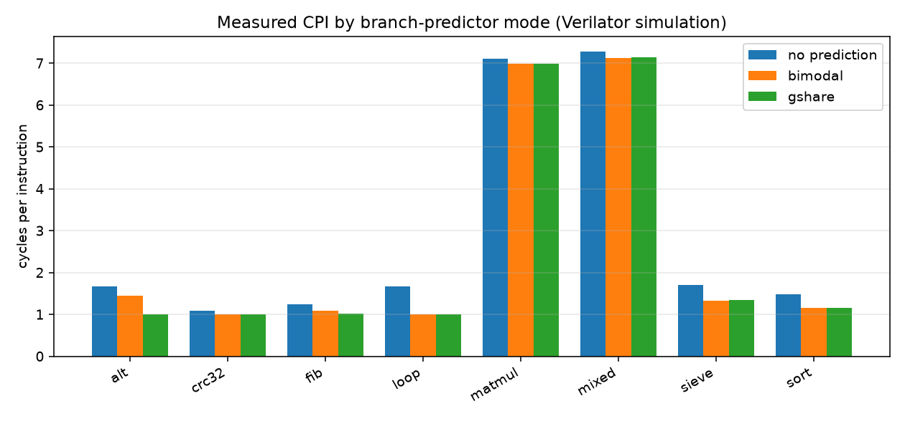

# riscv-rv32im-core

A from-scratch **RV32IM** RISC-V core in SystemVerilog: a 5-stage pipeline with
full hazard handling, an iterative multiply/divide unit, and a configurable
branch predictor — verified instruction-by-instruction against its own
single-cycle reference model, and measured with on-chip performance counters.

<!-- Badge URLs assume GitHub user `Urvish-Kosta` — confirm before pushing. -->
[](https://github.com/Urvish-Kosta/riscv-rv32im-core/actions/workflows/ci.yml)
[](LICENSE)
-informational)


> **Scope, stated plainly:** designed and verified **entirely in simulation**
> (Verilator). Not run on FPGA or silicon. Every performance figure in this
> repository was produced by a committed script that anyone can re-run; none is
> estimated, and no industry-standard benchmark score (DMIPS or otherwise) is
> claimed. The reference model used for lockstep comparison is this project's
> own verified single-cycle core, **not** Spike — see
> [Verification](#verification).

---

## Results at a glance

| | |
|---|---|
| **Correctness** | 332,134 retired instructions compared in lockstep against the reference core across 18 programs — **0 divergences** |
| **ISA** | RV32I + RV32M, plus read-only `cycle`/`instret` and six performance CSRs |
| **Best measured CPI** | **1.00** on branch-predictable kernels (gshare); 1.16 on insertion sort |
| **Branch prediction** | strictly alternating branch: **50.1% → 0.3%** mispredicts moving bimodal → gshare |
| **MDU unit test** | 1012/1012 (all 8 M-ops × 64 edge-operand pairs + 500 random) vs. the behavioural spec |
| **Build** | zero Verilator warnings with `-Wall` and warnings fatal |



Full generated report: [`docs/results/performance.md`](docs/results/performance.md) ·
raw data: [`docs/results/benchmarks.csv`](docs/results/benchmarks.csv) ·
how to read it honestly: [`docs/benchmarks.md`](docs/benchmarks.md)

## What is actually built

- **Two cores from one ISA package.** `core_top.sv` is a single-cycle
  *functional reference*; `core_pipe.sv` is the 5-stage pipeline under test.
  Sharing the leaf modules and one behavioural spec function is what makes the
  differential verification meaningful rather than circular.
- **Hazard handling** — forwarding from EX/MEM and MEM/WB into EX, a WB→ID
  bypass, a single-bubble load-use stall, and a 2-cycle control flush.
- **RV32M** — iterative ~34-cycle multiply/divide stalling in EX, including the
  spec's divide-by-zero and `MIN_INT / -1` results.
- **Branch prediction** — full-tag 64-entry BTB + 256×2-bit PHT, selectable at
  runtime between `off`, `bimodal`, and `gshare`.
- **Measurement** — six performance counters readable as CSRs, plus a retire
  trace, lockstep comparator, annotated trace viewer, and report/plot
  generators.

## Verification

Correctness rests on a chain in which every link is independently anchored:

1. **ISA-derived expectations.** Self-checking assembly tests whose expected
   values were derived by hand from the RISC-V spec — an oracle independent of
   any core — validate the single-cycle reference.
2. **Reference → pipeline, in lockstep.** Both cores emit an identical-format
   retire trace; `tools/trace_compare.py` diffs them record-by-record and
   localizes any first divergence to an exact instruction. 18 programs,
   **332,134 instructions, 0 divergences**, including five compiled C kernels
   (real compiler output: prologues, spills, recursion, byte/half traffic).
3. **Adversarial randomized programs.** A committed generator emits hazardous
   straight-line code — dense RAW chains, immediate load-use consumption,
   store-data forwarding, mixed-in M ops — compared across all three predictor
   modes.
4. **Unit-level proof where it matters.** The iterative MDU is checked
   exhaustively on edge operands against `riscv_pkg::mdu_func`, the single
   behavioural encoding of the M-spec that the reference core also uses.

**On Spike:** lockstep against Spike plus the official `riscv-tests` is the
documented plan of record and is *not* claimed as done — Spike could not be
installed in the environment this was built in. The methodology above is
deliberately Spike-shaped (same HTIF `tohost` protocol, same lockstep
comparison), so adopting it later changes the golden model, not the approach.
See [`docs/verification.md`](docs/verification.md).

## Milestones

| Milestone | What it delivers | State |
|---|---|---|
| **M0** | Repo skeleton, toolchain scripts, Verilator smoke, CI | **done** |
| **M1** | Single-cycle RV32I reference + self-checking ISA tests | **done** |
| **M2** | 5-stage pipeline, no hazard logic (divergence on hazards *proven*) | **done** |
| **M3** | Forwarding, load-use stall, control flush | **done** |
| **M4** | RV32M multiply/divide + minimal Zicsr counters | **done** |
| **M5** | Branch prediction (bimodal/gshare) + perf counters + measured CPI | **done** |
| **M6** | Retire tracing, lockstep comparator, benchmark suite, reports | **done** |
| **M7** | Documentation, diagrams, embedded results, polish | **done** |

## Why this exists

The gap it closes: porting and integrating an existing core shows "I can bring
up a CPU." This project is the next tier — *architecting* a pipeline and
reasoning about its microarchitecture: the three hazard classes, forwarding
paths and their critical-path trade-offs, dynamic branch prediction, and CPI
analysis grounded in measurement rather than assertion.

Correctness is argued the way production teams argue it — an independently
anchored golden model, lockstep retire-trace comparison, adversarial randomized
stimulus, and unit-level proof of the trickiest arithmetic — and every claim in
this repository is reproducible from committed scripts in a hardware-free flow.

Two things this project treats as first-class, and which the documentation
records rather than hides:

- **Bugs found by running code**, with the symptom that exposed each one:
  a gshare index inconsistency caught because a *measured* mispredict rate
  contradicted theory; a multiplier dropping its high-word carry; a divider
  needing a 33-bit partial remainder; trace records attached to the wrong
  instruction; and a test of mine that made an implementation-dependent
  assumption the pipeline correctly refused to satisfy.
- **What is deliberately not here** — no FPGA/silicon claims, no Spike results,
  no Dhrystone approximation, no privileged spec. Each omission is stated with
  its reason.

## Repository layout

```
riscv-rv32im-core/
├── rtl/            core RTL: reference core, pipelined core, mdu, bpu, memories
├── sim/            Verilator harness + MDU unit TB (verilator/), committed
│                  waveform + GTKWave save file (waves/)
├── sw/             common/ (linker, crt, crt0), tests/ (ISA + pipeline), bench/ (8 kernels)
├── tools/          rvdisasm, trace_viewer, trace_compare, perf_report, plot_cpi, generators
├── scripts/        toolchain, run_tests, run_pipe_diff, run_lockstep,
│                  run_benchmarks, make_waves
├── docs/           architecture, pipeline, hazards, prediction, counters, tracing,
│                  benchmarks, verification, decisions, results/ (measured output)
└── .github/        CI workflow
```

## Quick start

Requires Verilator, a RISC-V cross-compiler (LLVM/clang or a
`riscv*-unknown-elf` GNU toolchain — the build scripts auto-detect either),
Python 3, and GNU Make. No hardware, no licensed tools.

```sh
bash scripts/build_toolchain.sh          # install/verify; --check to only verify

# Build both cores (zero warnings, warnings fatal)
make -C sim/verilator both

# 1. Unit: iterative MDU vs the behavioural M-spec function  (1012 cases)
make -C sim/verilator mdu_tb

# 2. ISA suite on the reference core, from hand-derived expected values
make -C sw/tests run

# 3. Lockstep: every retired instruction vs the reference  (332k instructions)
bash scripts/run_lockstep.sh

# 4. Differential: directed + randomized hazardous programs, all predictor modes
bash scripts/run_pipe_diff.sh

# 5. Measure: self-checking benchmarks, CPI and branch statistics
bash scripts/run_benchmarks.sh
```

Everything above runs in CI. To regenerate the committed report and plots:

```sh
bash scripts/run_benchmarks.sh --csv docs/results/benchmarks.csv
python3 tools/perf_report.py docs/results/benchmarks.csv -o docs/results/performance.md
python3 tools/plot_cpi.py   docs/results/benchmarks.csv --outdir docs/results
bash scripts/make_waves.sh               # regenerate sim/waves/hazard_showcase.vcd
```

Inspect a single program:

```sh
make -C sw/tests build
./sim/verilator/obj_dir_pipe/Vcore_pipe +hex=sw/tests/build/test_mem.hex \
    +bp=gshare +trace_file=run.trace
python3 tools/trace_viewer.py run.trace --head 20    # annotated, stalls marked
python3 tools/trace_viewer.py run.trace --stats
```

## Toolchain

| Tool | Role |
|---|---|
| **Verilator** | simulation of both cores and the MDU unit testbench (C++ harness) |
| **LLVM/clang + lld** *or* `riscv*-unknown-elf-gcc` | building RV32IM test programs and C benchmarks; auto-detected |
| **Python 3** (+ matplotlib, pandas) | trace tooling, program generators, reports and plots |
| **GNU Make** | build orchestration |
| **GTKWave** *(optional)* | viewing the committed waveform |

Spike and the official `riscv-tests` are **not** used by this repository. They
are the documented plan of record for future lockstep verification; no result
from either is claimed here.

## Documentation

| Document | Contents |
|---|---|
| [`docs/architecture.md`](docs/architecture.md) | module hierarchy, datapath diagram, deliberate simplifications |
| [`docs/pipeline.md`](docs/pipeline.md) | stage-by-stage description and pipeline-register contents |
| [`docs/hazards-and-forwarding.md`](docs/hazards-and-forwarding.md) | the three hazard classes and how each is resolved |
| [`docs/branch-prediction.md`](docs/branch-prediction.md) | BTB/PHT design, the gshare bug found by measurement, results |
| [`docs/performance-counters.md`](docs/performance-counters.md) | counter definitions and how the cycle accounting closes |
| [`docs/isa-support.md`](docs/isa-support.md) | exactly which instructions and CSRs are implemented |
| [`docs/verification.md`](docs/verification.md) | the full verification chain, milestone by milestone |
| [`docs/benchmarks.md`](docs/benchmarks.md) | the kernels, their oracle, and why Dhrystone is absent |
| [`docs/tracing.md`](docs/tracing.md) | retire traces, lockstep compare, viewer, committed waveform |
| [`docs/design-decisions.md`](docs/design-decisions.md) | 20 numbered decisions: choice, reasoning, trade-off |
| [`docs/results/`](docs/results/) | measured CSV, generated report, plots, capture provenance |

Also: [`CHANGELOG.md`](CHANGELOG.md) · [`CONTRIBUTING.md`](CONTRIBUTING.md) ·
[`SECURITY.md`](SECURITY.md) · [`CODE_OF_CONDUCT.md`](CODE_OF_CONDUCT.md)

## Limitations

Simulation-only: no FPGA or silicon, and therefore no synthesis timing, area,
or power numbers — the design has not been through a synthesis flow, and this
repository claims nothing about its clock frequency.

The ISA is RV32IM plus read-only counter CSRs. There is no privileged spec, no
traps or interrupts, no virtual memory, and no A/C/F/D extensions; `FENCE`,
`ECALL`, and `EBREAK` decode as NOPs. Memory is a pair of single-cycle Harvard
arrays — there is no cache hierarchy, so nothing here measures memory-system
behaviour. `docs/isa-support.md` lists the implemented set exactly.

The reference model for lockstep comparison is this project's own single-cycle
core; Spike and the official `riscv-tests` remain the documented plan of record
and have not been run. Constrained-random verification (cocotb) and
cache/predictor design-space exploration (C++) are deliberately **separate
sibling repos**, not part of this one.

## References

The microarchitecture was derived from these sources rather than copied from an
existing implementation; the RTL in this repository is written from scratch.

- *The RISC-V Instruction Set Manual, Volume I: Unprivileged ISA* — the
  normative reference for every instruction implemented here, including the
  RV32M divide-by-zero and `MIN_INT / -1` results encoded in
  `riscv_pkg::mdu_func`.
- Patterson & Hennessy, *Computer Organization and Design, RISC-V Edition* —
  the classic 5-stage pipeline, forwarding paths, and the single-bubble
  load-use stall.
- Harris & Harris, *Digital Design and Computer Architecture, RISC-V Edition*.
- S. McFarling, *Combining Branch Predictors* (WRL TN-36, 1993) — gshare.
- Verilator documentation, for the simulation and lint flow.

`riscv-tests` and `riscv-isa-sim` (Spike) are referenced as the plan of record
for future verification work; neither is used or vendored here.

## License

MIT — see [LICENSE](LICENSE).

## Author

**Urvish Kosta** — Embedded Systems & Digital Design Engineer.
GitHub: [@Urvish-Kosta](https://github.com/Urvish-Kosta)
<!-- Confirm this username before publishing: it also appears in the CI badge
     URLs at the top of this file. -->

Every design decision in this repository is recorded with its reasoning and
trade-off in [`docs/design-decisions.md`](docs/design-decisions.md), and every
bug found by running the code is documented with the symptom that exposed it.
Both are there to be interrogated — questions and corrections are welcome.
