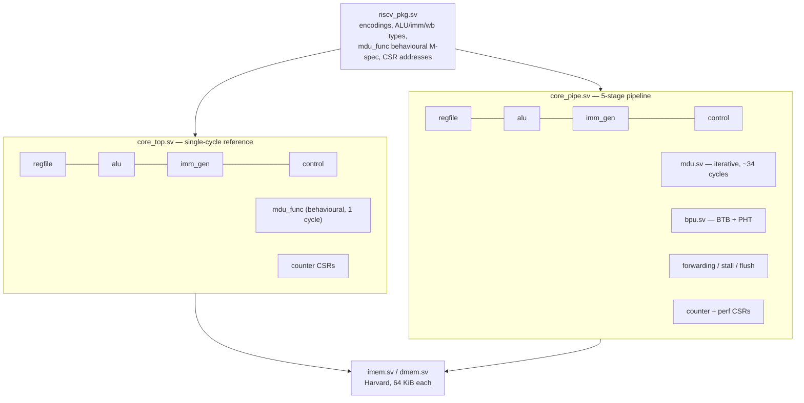

# Architecture

> **Status:** current as of milestone **M7** (final).

Two cores share one set of leaf modules and one ISA package. The single-cycle
core is the *functional reference*; the pipelined core is the design under
test. Everything in the verification story rests on that separation.

## Module hierarchy



`riscv_pkg::mdu_func` is the single encoding of RV32M semantics: the reference
core evaluates it directly, while `mdu.sv` implements the same semantics
iteratively. Their agreement is proven exhaustively on edge operands by
`sim/verilator/tb_mdu.sv` and again at system level by every differential run.

## Pipeline datapath

```
        ┌─────────┐   ┌─────────┐   ┌─────────┐   ┌─────────┐   ┌─────────┐
        │   IF    │──▶│   ID    │──▶│   EX    │──▶│   MEM   │──▶│   WB    │
        └─────────┘   └─────────┘   └─────────┘   └─────────┘   └─────────┘
          PC, imem      decode,       ALU / MDU,     dmem,        regfile
          BTB+PHT       regfile rd,   branch cond,   load ext.,   write
          predict       imm_gen       target, CSR    wb select
             ▲              ▲             │  │            │            │
             │              │             │  │            │            │
             │              └──WB→ID bypass──┼────────────┼────────────┘
             │                              │  │          │
             │                    forward ◀──┘  └──────────┤ EX/MEM (ALU, pc+4)
             │                    forward ◀────────────────┘ MEM/WB (incl. loads)
             │                              │
             └──────────redirect (actual npc ≠ predicted npc)
```

Pipeline registers: **IF/ID** `pc, instr, pred_npc, bp_idx, valid` · **ID/EX**
control + `pc, rs1/rs2 values, imm, rd, funct3, csr_addr, pred_npc, valid` ·
**EX/MEM** control + `result, store data, pc+4, rd, funct3, valid` · **MEM/WB**
`reg_write, rd, writeback value, valid` (+ retire-aligned store view and
`pc/instr` for tracing).

## Key mechanisms and where they are documented

| Mechanism | Summary | Detail |
|---|---|---|
| Hazard handling | forwarding EX/MEM + MEM/WB → EX, WB→ID bypass, 1-cycle load-use stall, 2-cycle flush | [`hazards-and-forwarding.md`](hazards-and-forwarding.md) |
| Branch prediction | full-tag 64-entry BTB + 256×2-bit PHT, `off`/`bimodal`/`gshare` | [`branch-prediction.md`](branch-prediction.md) |
| Multiply/divide | iterative ~34-cycle unit stalling in EX; behavioural spec function | [`isa-support.md`](isa-support.md) |
| Counters | `cycle`/`instret` + six non-standard perf CSRs | [`performance-counters.md`](performance-counters.md) |
| Tracing | retire traces, lockstep compare, annotated viewer | [`tracing.md`](tracing.md) |

## Deliberate simplifications

Single hart; no caches (Harvard single-cycle memories); no privileged modes,
traps, or interrupts; no virtual memory; no A/C/F/D extensions. `FENCE`,
`ECALL`, and `EBREAK` decode as NOPs. CSR *writes* have no effect because every
implemented CSR is a read-only counter. These are scope choices, not
oversights, and each is stated in [`isa-support.md`](isa-support.md) so nothing
here is claimed beyond what runs.
